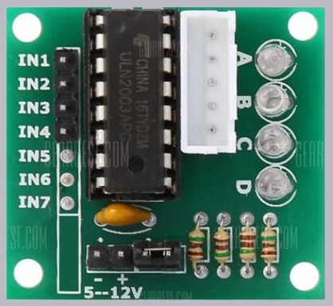

# Stepper Motor Class for Python3 and pigpio

ステッピングモーター(stepper motor) Python3ライブラリ

## StepMtr class

* シングルスレッド版
* 指定されたカウントまでブロックし、他の操作ができない。

## StepMtrTh class

* マルチスレッド版
* 回転中でも制御可能。


## 動作環境

* 本体: Raspberry Pi
* モータードライバー: DRV8835, ULN2003
* ステッピングモーター: 28BYJ-48-5V
* プログラミング言語: Python3
* GPIO制御ライブラリ: pigpio


## 0. TL;DR

```bash
$ cd ~
$ python3 -m venv env1
$ cd env1
$ . ./bin/activate
(env1)$ git clone https://github.com/ytani01/StepperMotor.git
(env1)$ cd StepperMotor
(env1)$ pip3 install -r requirements.txt
(env1)$ sudo pigpiod
(env1)$ ./StepMtr.py -h
(env1)$ ./StepMtrTh.py
```

## 1. Hardware

### 1.1 Raspberry Pi + DRV8835 + 28BYJ-48-5V

配線と、引数の順番の違いに注意！


### 1.2 ULN2003モジュールの場合

```
AIN1 -> IN1
AIN2 -> IN2
BIN1 -> IN3
BIN2 -> IN4
```



## 2. Software

### 2.0 Architecture

呼び出し階層
```
 ------------
| StepMtrTh  |
|------------|
|  StepMtr   |
|------------|
|  pigpio    |
 ------------
```

### 2.1 create python3 venv

```bash
$ cd ~
$ python3 -m venv env1
```

### 2.2 activate venv

```bash
$ . ~/env1/bin/activate
(env1)$
```

### 2.3 download

```bash
$ cd ~/env1
$ git clone https::/github.com/ytani01/StepperMotor.git
```

### 2.4 install python packages

```bash
(env1)$ cd ~/env1/StepperMotor
(env1)$ pip3 install -r requirements.txt
```

## 3. Sample

see usage as follows:
```bash
$ sudo pigpiod
$ . ~/env1/bin/activate
(env1)$ cd ~/env1/StepperMotor
(env1)$ ./StepMtr.py -h
(env1)$ ./stepMtrTh.py -h
```

## 4. Class References

## A. Links

* [DRV8835](https://akizukidenshi.com/catalog/g/gK-09848/)
* [28BYJ-48-5V and ULN2003 5個セット](https://www.amazon.co.jp/gp/product/B010RYH74U/)
* [pygpio -- Python Interface](http://abyz.me.uk/rpi/pigpio/python.html)
