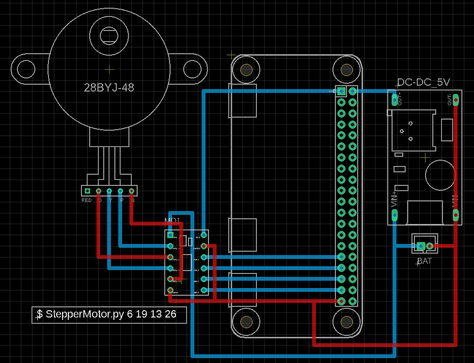
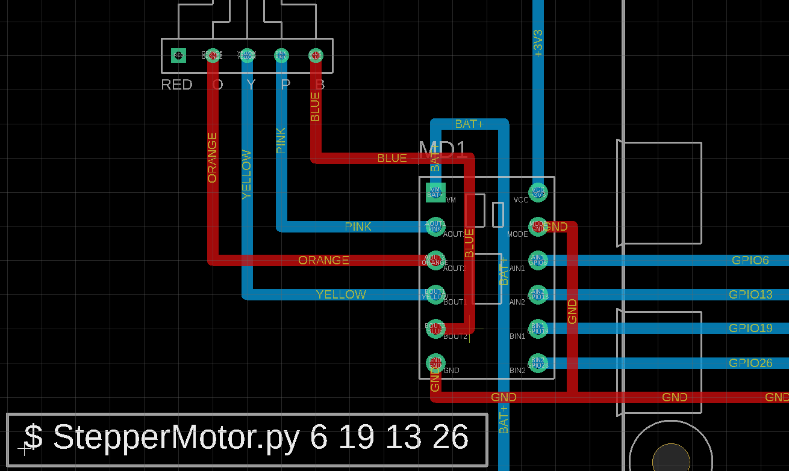
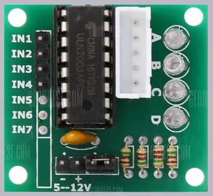

# Stepper Motor Class for Raspberry Pi, Python3 and pigpio

ステッピングモーター(stepper motor) Python3ライブラリ

## StepMtrTh class

* マルチスレッド版
* 回転中でも制御可能。


## StepMtr class

* シングルスレッド版
* 指定されたカウントまでブロックし、他の操作ができない。


## 動作環境

* 本体: Raspberry Pi
* モータードライバー: DRV8835, ULN2003
* ステッピングモーター: 28BYJ-48-5V
* プログラミング言語: Python3
* GPIO制御ライブラリ: pigpio


## 0. TL;DR

Install
```bash
$ cd ~
$ python3 -m venv env1
$ cd env1
$ . ./bin/activate

(env1)$ git clone https://github.com/ytani01/StepperMotor.git
(env1)$ cd StepperMotor

(env1)$ pip install -U pip setuptools wheel
(env1)$ hash -r
(env1)$ pip install .
```

Run test program
```bash
(env1)$ sudo pigpiod
(env1)$ python -m stepmtr PIN1 PIN2 PIN3 PIN4
```

Sample program
[sample.py](sample.py)


## 1. Hardware

### 1.1 Raspberry Pi + DRV8835 + 28BYJ-48-5V

配線と、引数の順番の違いに注意！




### 1.2 ULN2003モジュールの場合

```
AIN1 -> IN1
AIN2 -> IN2
BIN1 -> IN3
BIN2 -> IN4
```




## 2. API

```bash
$ python3 -m pydoc stepmtr
```


## 3. Software Architecture

呼び出し階層
```
 -----------------
| StepMtrTh class |
|-----------------|
|  StepMtr class  |
|-----------------|
|  pigpio class   |
 -----------------
```


## A. Links

* [DRV8835](https://akizukidenshi.com/catalog/g/gK-09848/)
* [28BYJ-48-5V and ULN2003 5個セット](https://www.amazon.co.jp/gp/product/B010RYH74U/)
* [pygpio -- Python Interface](http://abyz.me.uk/rpi/pigpio/python.html)
