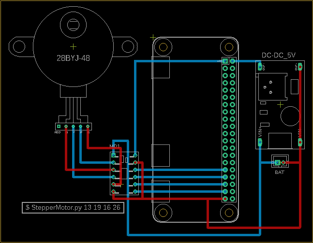

# StepperMotor.py

ステッピングモーター(stepper motor)ライブラリ

## 1. wiring stepper motor to Raspberry Pi




## 2. install

### 2.1 create python3 venv

```bash
$ cd ~
$ python3 -m venv env1
```

### 2.2 activate venv

```bash
$ . ~/env1/bin/activate
(env1)$
```

### 2.3 download

```bash
$ cd ~/env1
$ git clone https::/github.com/ytani01/StepperMotor.git
```

### 2.4 install python packages

```bash
(env1)$ cd ~/env1/StepperMotor
(env1)$ pip3 install -r requirements.txt
```

## 2. Sample

see usage as follows:
```bash
$ sudo pigpiod
$ . ~/env1/bin/activate
(env1)$ cd ~/env1/StepperMotor
(env1)$ ./StepperMotor.py -h
```

